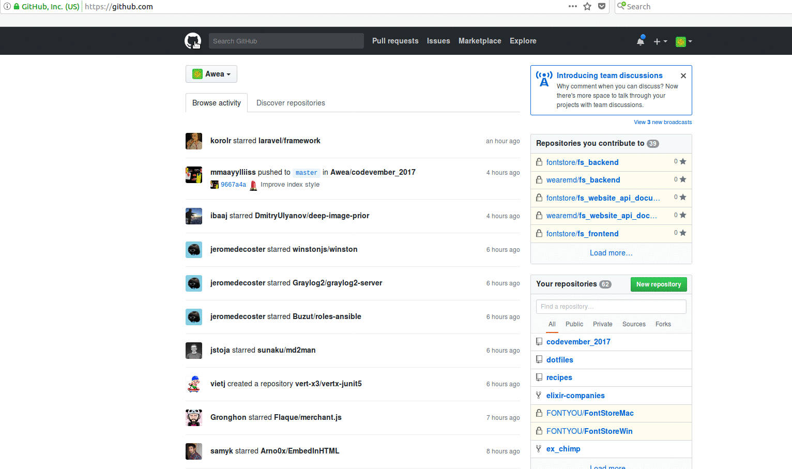

# Vigil

"Simple" feed parser/reporter

## Configuration

### Get api_token_feed



### config/secret.exs

```elixir
use Mix.Config

config :vigil,
  github: %{
    username: "username",
    token: "api_token_feed"
  }

config :vigil, Vigil.Mailer,
  adapter: Bamboo.SMTPAdapter,
  server: "smtp_server",
  hostname: "domain_name",
  port: port,
  username: "smtp_username",
  password: "smtp_password",
  ssl: true,
  tls: :if_available,
  retries: 1
```

## Release

* `mix edeliver upgrade production`
